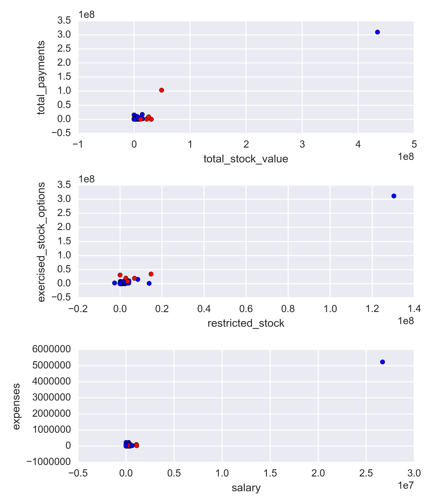

# Using Machine Learning to Identify Fraud in Enron Emails
### By Vítor Bernardes

## Introduction

In the investigation resulting from the Enron corporate fraud scandal in the early 2000’s, a significant amount of typically confidential information was made public, including thousands of emails and detailed financial data. The goal of this investigation is to answer the following question: is it possible to use machine learning to comb through that information and point out persons of interest for fraud?

Machine learning would be a useful tool in this case for its ability to read large volumes of data and discover relationships based on its features. In this case, we will be specifically looking at the machine learning application of **classification**, in order to identify and classify each person in our data set as a person of interest or not.

Since we have data about executives’ financial information (including salary, bonus, stock options) and the content of tens of thousand emails (including body and addresses), we will use machine learning to try and look for any patterns that can possibly exist in this data that are common to people involved in fraud and might help identify them.

## Data Exploration

But before we do any of that, let’s take a first look at our data set and get acquainted with the data we will have to work on.

We have **146 data points**. At first sight, it looks like we have financial and email data related to 146 different people involved with Enron — which is not exactly the case, as will be shown in the section about outliers. Out of those 146 data points, **18 are persons of interest**, or approximately **14%** of our data set.

### Features and Outliers

The data set also contains **20 features** we can work with, which is the actual financial and email information for each person.

Digging a little deeper, let’s plot a few visualizations of some features so we can get a better idea of how the values are spread out. The red points are persons of interest, and the blue points are non-POI.

As we can see, on all plots there is one outlier which contains values significantly higher than the rest of the data points. However, upon investigating who those points refer to, we discover the person’s name is *TOTAL*. That point does not refer to an actual person, instead it is an error in our data set, that possibly includes some summation row in a spreadsheet the data was gathered from. We should definitely remove that point from our data set before proceeding with our analysis.

Also, upon reviewing the names of the people contained in the data set, we discover that one of them is not actually a person, but instead a company: *THE TRAVEL AGENCY IN THE PARK*. That point will be removed as well.

In addition, many of these features have missing values for a number of people. The following table shows the features contained in the data set and the number of missing values for each (with the *TOTAL* data point removed).

| Feature | # Missing Values | Proportion of Missing Values |
|:--|:--|:--|
| total_stock_value | 20 | 0.138 |
| total_payments | 21 | 0.145 |
| email_address | 34 | 0.234 |
| restricted_stock | 36 | 0.248 |
| exercised_stock_options | 44 | 0.303 |
| salary | 51 | 0.352 |
| expenses | 51 | 0.352 |
| other | 53 | 0.366 |
| to_messages | 59 | 0.407 |
| shared_receipt_with_poi | 59 | 0.407 |
| from_messages | 59 | 0.407 |
| from_this_person_to_poi | 59 | 0.407 |
| from_poi_to_this_person | 59 | 0.407 |
| bonus | 64 | 0.441 |
| long_term_incentive | 80 | 0.552 |
| deferred_income | 97 | 0.669 |
| deferral_payments | 107 | 0.738 |
| restricted_stock_deferred | 128 | 0.883 |
| director_fees | 129 | 0.89 |
| loan_advances | 142 | 0.979 |

We can see there is a significant number of features that unfortunately have a very high proportion of missing values, as high as 0.979 in one case. That information is important as we should focus our analysis on using the features that have as many available values as possible, which are more likely to yield better results for our investigation.

Also, upon investigation, it was discovered that one person, *Eugene E. Lockhart*, has no usable values in our data set, so we should remove him as well.

### Initial Feature Selection

For the selection of features, I decided to start with the features that have less than 50% of missing values. That ensures we have as many data points as possible for our investigation. Later, I will apply the univariate selection method *SelectKBest* to automatically pick a number of features that are most relevant to our model and contribute the most to it. Reducing the number of features allows us to simplify our model, decrease training time, and help avoid overfitting. The implementation of *SelectKBest* in our project will be discussed further below.

Since the two algorithms we will be comparing (*Gaussian Naive Bayes* and *Decision Trees*) do not require feature scaling, feature scaling was not implemented on this project.

### Creating a New Feature

I decided to try to implement a new feature that might help identify whether a person is a POI or not. I want to calculate the proportion of emails received from a POI in relation to all emails received by a person. The idea is that, the higher that proportion, the closer is the relationship between said person and POIs, which might be an indication that the person herself is a POI too.

## Picking and Tuning an Algorithm

In my investigation, I decided to compare the performance of two algorithms: *Gaussian Naive Bayes* and *Decision Trees*.

*Decision Trees* accept several parameters that must be set prior to starting the learning process, and cannot be inferred from the data. It is vital to set proper values for these parameters as they directly impact the performance of the algorithm. It is also a sensitive step, as too much parameter optimization might lead to an overfit model (a model that only performs well on the data it was trained on, and is not capable of generalizing its classification on new data), and too little might lead to a suboptimal model.

I opted to use *GridSearchCV* to automatically test a number of different parameters and programmatically pick ones that displayed the best performance. The following table shows the parameters tuned and the values *GridSearchCV* tested and chose.

| Parameter | Tested Values | Chosen Value |
|:--|:--|:--|
| criterion | gini, entropy | gini |
| splitter | best, random | random |
| max_depth | 1, 10, 100 | 1 |
| min_samples_split | 2, 10, 100 | 2 |

### Algorithm Validation Comparison

I decided to use the Stratified Shuffle Split method to generate 100 different sets of train/test data, with 30% of data points reserved for testing the model’s performance. This particular method is the preferred one for this investigation due to the imbalanced nature of our data set, which contains much more negative samples (non-POIs) than positive ones (POIs). In these cases, stratified sampling ensures relative class frequencies are approximately maintained in both train and test sets.

Then I calculated the mean *precision* and *recall* (these will be explained below) of the models’ performance on each data set. The following table displays the results obtained.

| Algorithm | Metric | Mean |
|:--|:--|:--|
| Naive Bayes | Precision | 0.48 |
| Naive Bayes | Recall | 0.31 |
| Decision Trees | Precision | 0.24 |
| Decision Trees | Recall | 0.13 |

As we can see, the performance of *Naive Bayes* is higher than the *Decision Tree*, so that will be the algorithm we will use in our final analysis.

### Fine-tuning Feature Selection

For each of the 100 sets of train/test data, I applied the *SelectKBest* method described above to select four features that were most relevant to the *Naive Bayes* algorithm. Then, I created a function to automatically count the number of times each feature was selected, and picked the four features that were most frequently selected for the random data sets. They were (in no particular order): *total_stock_value*, *exercised_stock_options*, *salary*, and *bonus*. These are the features we will use in our final analysis.

Here is an example of feature scores calculated by *SelectKBest* for one of the 100 sets:

| Feature | Score |
|:--|:--|
| bonus | 34.4 |
| total_stock_value | 20.57 |
| exercised_stock_options | 19.83 |
| salary | 15.99 |

Since the feature we created (*proportion_from_poi*) was not selected by *SelectKBest*, we will not use it with our final model. For comparison to the values showed on the table above, the mean score for *proportion_from_poi* calculated by *SelectKBest* was 2.54921522098.

## Running Final Model

Our comparison showed the algorithm that presented the best results was *Naive Bayes*, with the features *total_stock_value*, *exercised_stock_options*, *salary*, and *bonus*. We are going to use those elements to build our final model to predict POIs.

### Final Model Validation and Evaluation

In order to test the performance of our final model, it is important to validate it. Validating our model ensures we are not falling prey to overfitting and gives us an estimate of the model’s performance on an independent data set.

I will use once again use stratified shuffle splitting to generate different sets of train/test data. This time, I will generate 1,000 sets and evaluate the performance of our final model using two different metrics: *precision* and *recall*.

*Precision* shows how many true positives were identified out of all positives. In our specific case, it means, out of all people identified as POIs, how many were actually POIs. *Recall* shows how many true positives were identified out of all “true” data points. In other words, it means, out of all actual POIs in our set, how many of them were identified, or recalled, by our model.

The mean values for these metrics after running our model on the 1,000 different data sets generated by stratified shuffle splitting are presented on the table below.

| Metric | Mean |
|:--|:--|
| Precision | 0.469 |
| Recall | 0.314 |

Those metrics tell us the following about our model’s performance on the test data sets: Approximately 47% of persons identified as POIs by our model were actually POIs (*precision*), and approximately 31% of all POIs were identified as such by our model (*recall*).
